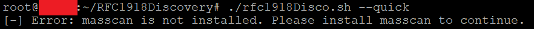
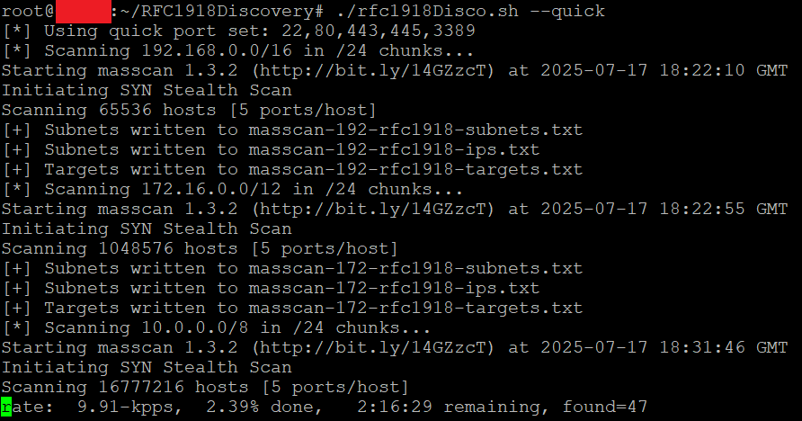
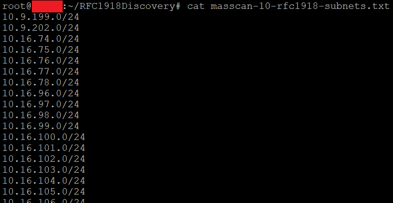
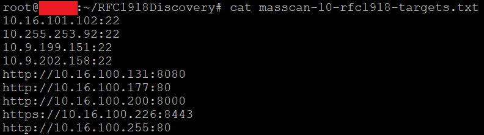

# rfc1918Disco

rfc1918Disco is a fast reconnaissance script designed to discover live hosts, open ports, and target services within RFC1918 private IP address spaces (`192.168.0.0/16`, `172.16.0.0/12`, and `10.0.0.0/8`). It utilizes `masscan` for high-speed scanning and Python utilities to extract subnets, IPs, and service targets from scan results. The default extensive port set comprehensively covers the vast majority of common device types.

---

## Features

- Systematically Scans all private IP space in `/24` chunks for broad discovery
- Fast and comprehensive discovery using masscan and port set designed to find the ideal balance between speed and maximum discovery completeness
- Parses results into three clean output files:
  - `target-subnets.txt`: Unique /24 subnets containing live hosts (for nmap -p1-65535, Sn1per discovery, etc)
  - `discovered-ips.txt`: Unique active IPs (for individual analysis)
  - `discovered-targets.txt`: `ip:port` and `schema://ip:port` targets (for tools like Nuclei, etc)

---

## Install

   ```bash
   sudo apt update
   sudo apt install masscan python3
   git clone https://github.com/your-org/rfc1918Disco.git
   ```

   

---

## Use

   > **Note:** You must run this script as root due to raw packet access.

   > **Note:** If masscan-*-rfc1918.txt files already exists you will be asked if you want to overwrite or skip massscan. Skipping will result in the report generation from the existing files.

   > **Note:** Doesn't work under WSL due to raw socket limitations.

   Full scan (default, extensive port set):
   ```bash
   sudo ./rfc1918Disco.sh
   ```

   Quick scan (minimal port set):
   ```bash
   sudo ./rfc1918Disco.sh --quick
   ```

   

   

   

## Temporary Files
Temporary working files such as masscan-*-rfc1918.txt and /tmp/discovered-* are used during the process. You may delete them after analysis.
